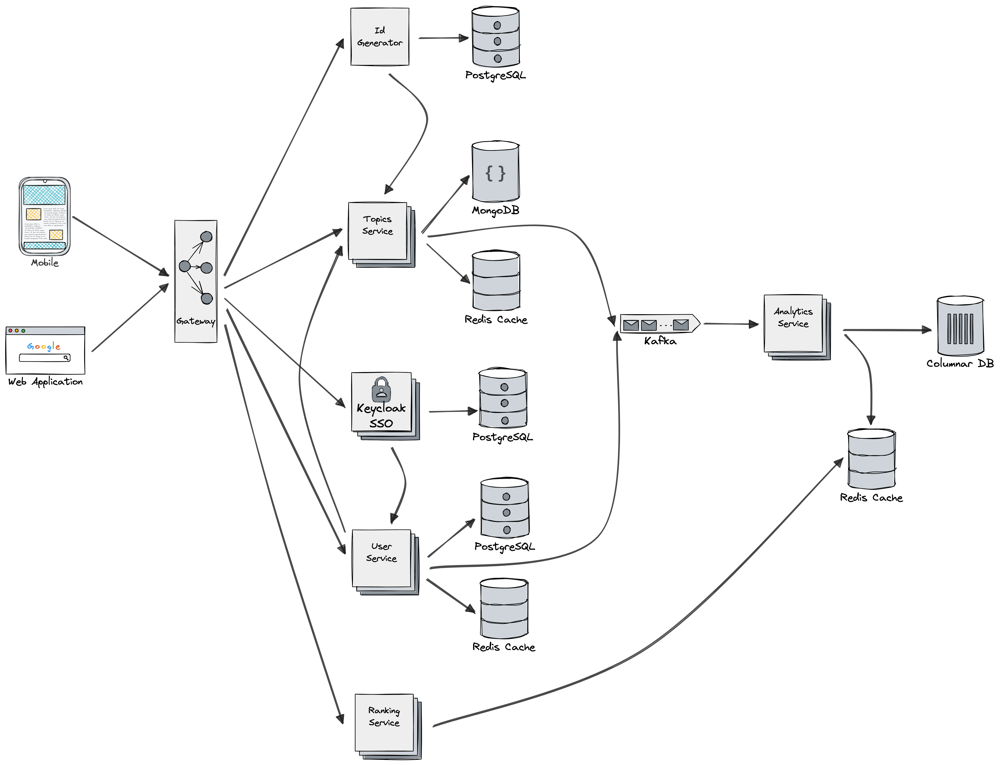

# Forum REST API Backend

## Overview

Microservice-based REST API backend for a forum application. The backend is built using Java with Spring. The application utilizes most of the current technologies used in enterprise solutions. The application is containerized using Docker and deployed using Docker Compose.

## Features


## Table of Contents

- [Architecture](#architecture)
  - [Diagram](#diagram)
  - [Components](#components)
  - [Data Flow](#data-flow)
- [Getting Started](#getting-started)
  - [Prerequisites](#prerequisites)
  - [Installation](#installation)
- [Services](#services)
  - [Keycloak](#keycloak)
  - [Users](#users)
  - [Topics](#topics)
  - [Analytics](#analytics)
- [Configuration](#configuration)
  - [Environment Variables](#environment-variables)
- [Deployment](#deployment)
  - [Docker Compose](#docker-compose)
- [Usage](#usage)
  - [Authentication](#authentication)
  - [API Requests](#api-requests)
- [Contributing](#contributing)
- [License](#license)

## Architecture

### Diagram



### Components

- [ ] **Gateway**: API Gateway using Spring Cloud Gateway.
- [x] **Authentication**: User authentication and authorization using Keycloak as SSO.
- [x] **Users**: Synchronous REST API for user management using PostgreSQL database.
- [x] **Topics**: Reactive REST API for topic management using MongoDB database and caching using Redis.
- [ ] **Id Generator**: Unique ID generation using Snowflake for Topics service.
- [ ] **Monitoring**: Monitoring using Prometheus and Grafana.
- [ ] **Tracing**: Distributed tracing using Jaeger.
- [ ] **Analytics**: Analytics service for tracking user activity.

### Data Flow

1. **Gateway**: Receives incoming requests and routes them to the appropriate service.
2. **Authentication**: Authenticates the user and generates a JWT token.
3. **Users**: Manages user data and provides user information
4. **Topics**: Manages topic data and provides topic information
5. **Id Generator**: Generates unique IDs for topics
6. **Monitoring**: Monitors the health of the services
7. **Tracing**: Traces the requests between services
8. **Analytics**: Tracks user activity

## Getting Started

### Prerequisites

- **Docker**: Containerization
- **Docker Compose**: Deployment

### Installation

1. Clone the repository

   ```sh
   git clone https://github.com/LudwigAndreas/Forum-REST-API-Backend.git
   ```

2. Change directory

   ```sh
    cd Forum-REST-API-Backend
    ```

3. Build the Docker images

   ```sh
   docker-compose build
   ```

4. Start the services

   ```sh
    docker-compose up
    ```

## Services

### Keycloak

Keycloak is used as the SSO for user authentication and authorization. The service is responsible for generating JWT tokens for authenticated users.
Keycloak is pre-configured with the following admin credentials:

```text
Username: admin
Password: admin
```

Keycloak can be accessed at [http://localhost:8080](http://localhost:8080).

### Users

User service is a synchronous REST API for user management. It implements CRUD operations for user data. The service uses a PostgreSQL database for storing user data. Service integrated with Keycloak: when a user is created, a new user is also created in Keycloak.

User service can be accessed at [http://localhost:8081](http://localhost:8081).

### Topics

Topic service is a reactive REST API for topic management. It implements CRUD operations for topic data. Reactive stack based on Spring WebFlux. The service uses a MongoDB database for storing topic data. The service also uses Redis for caching topic data. ~~The service also uses an Id Generator service for generating unique IDs for topics (it used for sharding).~~

Topic service can be accessed at [http://localhost:8082](http://localhost:8082).

### Analytics

Analytics service is responsible for tracking user activity. The service is **not implemented yet**. The data is fed into the service via Kafka.

## Configuration

### Environment Variables

The services are configured using environment variables. The environment variables are defined in the `.env` file.

```env
# Keycloak
KEYCLOAK_URL=http://keycloak:8080
KEYCLOAK_REALM=forum
KEYCLOAK_CLIENT_ID=forum
KEYCLOAK_CLIENT_SECRET=secret

# Users
USERS_URL=http://users:8081

# Topics
TOPICS_URL=http://topics:8082
```

## Deployment

### Docker Compose

The application is containerized using Docker and deployed using Docker Compose. The services are defined in the `docker-compose.yml` file.

```sh
docker-compose up
```

## Usage

Examples of how to use the API endpoints described in the `docs` directory. (**Not implemented yet**)

### Authentication

To authenticate a user, send a POST request to the Keycloak token endpoint with the user credentials.

```sh
curl -X POST http://localhost:8080/auth/realms/forum/protocol/openid-connect/token \
  -H 'Content-Type: application/x-www-form-urlencoded' \
  -d 'username=admin&password=admin&grant_type=password&client_id=forum&client_secret=secret'
```

### API Requests

The services can be accessed using the following endpoints:

- **Users**: [http://localhost:8081](http://localhost:8081)
- **Topics**: [http://localhost:8082](http://localhost:8082)
- **Analytics**: [http://localhost:8083](http://localhost:8083) (**Not implemented yet**)

Documentation for the API endpoints can be found in the `docs` directory. (**Not implemented yet**)

## Contributing

Contributions are welcome! Please feel free to submit a Pull Request.
